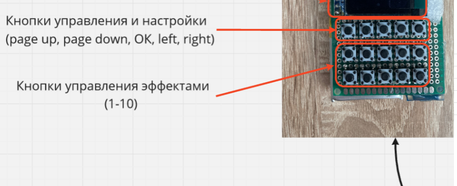

# This repository contains everything you need about controllers and consoles.

<strong>NODEMCU-V2 CP2102 2-Button Controller Guide</strong>

This instruction provides essential instructions for using the **NODEMCU-V2 CP2102** controller with two-button effect switching. It covers SD card use, file formatting, connections, and button behavior.
It includes how to manage the Micro SD card, connect the controller, use control buttons, and update files.

---

## 1. System Description

The control system includes the following components:

* **NODEMCU-V2 CP2102 controller**
* **Micro SD memory card**
* **Connectors** (type and quantity may vary depending on product)
* **Two physical control buttons** for switching lighting or visual effects
  
<em>Micro SD card</em>

<em>An example of a connector from the possible</em>

<em>Control buttons</em>

---

## 2. Micro SD Card: Usage Instructions

### ➤ Inserting and Removing the Micro SD Card

To **remove** the card:

1. Gently **press the card inward** until you hear a click.
2. The card will partially eject and can be removed.

To **insert** the card:

1. Ensure the card is properly aligned.
2. Push it into the slot until it clicks into place.

> **Important:** Always handle the SD card gently. Insert/remove only when the controller is powered off.

<em>Inserting/Removing the Card</em>

---

### ➤ Accessing and Updating Files on the SD Card

After removing the card from the controller:

1. Insert it into a **card reader adapter**.
2. Connect the adapter to your **PC or laptop**.
3. The SD card will contain several important files.

####  Typical Files Found on the SD Card

* **Effect files:**  
  `S1.txt`, `S23.txt`, etc.  
  >  These must start with **"S"** — this is a required format for the controller to recognize them.

* **Configuration file:**  
  `config.txt`  
  > Used to set parameters like **brightness**, speed, etc.

* **Log file:**  
  `log.txt`  
  > Automatically created each time the controller starts.  
  This confirms that the controller is functioning correctly.

Example for adjusting brightness:
 1. Open config.txt and locate the line: led.brightness = XX%.
 2. Change XX% to your desired value (e.g., 100% for maximum brightness).
    
 Note: Higher brightness shortens the operational duration

### ➤ File Updates

To update or replace the effect or configuration files:

1. **Copy** the downloaded or updated `.txt` files to the SD card.
2. After copying, **safely eject** the SD card adapter from your PC or laptop.
3. **Remove** the SD card from the adapter.
4. **Insert** the card back into the controller until it clicks securely.

> This ensures that all file changes are saved correctly and the controller can read them on startup.

## 3. Connecting the Controller to the Device

Connect the controller's connectors to the corresponding connectors on the device. Make sure the plug type and pin count match exactly to avoid malfunction.

Supported connector types include:

* **JST SM 3-pin**
* **JST SM 4-pin**
* **GX 16 – 10-pin**
* **GX 16 – 8-pin**

### Connector Reference Images

<em>JST SM 3-pin</em>

<em>JST SM 4-pin</em>

<em>GX 16 – 8-pin</em>

>  Ensure all connectors are **securely inserted** to prevent intermittent signal or power loss.

---

## 4. Using Control Buttons

The controller is equipped with **two control buttons**:

* One button cycles **effects forward**.
* The other button cycles **effects backward**.

> 📏 The length of the wires varies:
> * Standard length: **1 meter**
> * Compact version: **150 mm**

### ➤ Operation

* Pressing a button **once** changes the current effect by **one step** (either forward or backward depending on the button pressed).

---

<strong>Instructions for using DMX controllers</strong>

## Description

---

  

<strong>Instructions for using the 15-button console with OLED screen and battery</strong>

## 1.	Assembly:

●	Install the antenna and use a PH00 screwdriver to unscrew the screw on the cover.

°	Take the battery boxes and insert the batteries into the, observing the polarity (the last part is a minus, a slightly convex part is a plus).
**ATTENTION!** If you confuse the polarity, the box can get very hot and melt, it is possible to get burned. After installing the battery, close the lid and tighten the screw back.

●	The power button is on the side.

## 2.	Terms of Use:

**●	IT IS IMPORTANT NOT TO TOUCH THE FIRST 3 BUTTONS IN THE TOP ROW ON THE LEFT!**

●	The two buttons on the top of the row on the left indicate the direction of backward and forward.
The blue and yellow rows indicate the effect numbers, the number will be displayed on the screen (the numbers are marked below). After the 10th effect is reached, the switch starts with the green forward button (in case there are more than 10 effects).

[Video tutorial: 15 button remote](https://youtu.be/plJmO6gk3sM?si=G4Bidx0-QKFGdW-2)

